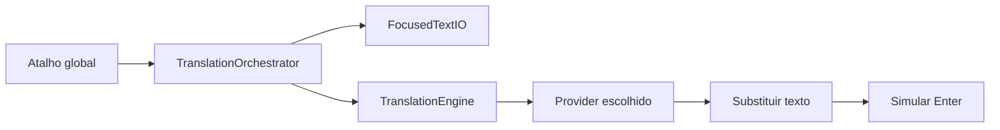
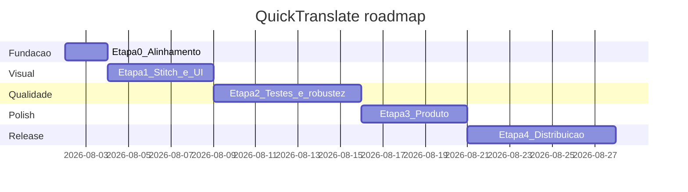

# Planejamento completo — QuickTranslate

## Visão do produto

**QuickTranslate** é um app nativo de menu bar para macOS que traduz o texto do campo focado via atalhos globais — rápido, discreto e quase sem interface.

| Item | Valor |
|------|--------|
| Plataforma | macOS 15+ (alvo futuro: Tahoe 26 / Liquid Glass) |
| Stack | SwiftUI + AppKit, Xcode, sem SPM |
| Bundle | `com.quicktranslate.app` |
| Fluxo central | Atalho → ler campo (AX) → traduzir → substituir → (opcional) Enter |
| Provedores | Apple Translation, DeepL, Google, OpenAI/LM Studio, Custom HTTP |



---

## Estado atual (baseline)

Já implementado em [`QuickTranslate/`](QuickTranslate/):

- Menu bar (`MenuBarView`), onboarding (`OnboardingView`), preferências (`SettingsView`)
- Atalhos ⌃⌥T / ⌃⌥⏎ (`HotkeyMonitor`, `HotkeyChord`)
- 5 provedores + Keychain + login item
- Feedback visual no ícone (idle / translating / success / error)

Gaps conhecidos:

- App Icon sem PNGs em [`Assets.xcassets/AppIcon.appiconset`](QuickTranslate/Assets.xcassets/AppIcon.appiconset)
- Sem design system / mockups formais
- Sem testes, CI, assinatura/notarização documentada
- UI hardcoded em PT; sem seleção de idioma origem

---

## Etapa 0 — Fundação e alinhamento (1–2 dias)

**Objetivo:** deixar o repositório e a documentação coerentes com o código.

- Alinhar README e textos do onboarding aos atalhos reais (⌃⌥T / ⌃⌥⏎)
- Primeiro commit Git estruturado (código sem `DerivedData` / `swiftly.pkg`)
- Definir critérios de aceite da v1.0 (lista abaixo)
- Gerar identidade visual (ícone + telas) via **Google Stitch** — ver prompt no final

**Aceite v1.0:** traduzir/substituir no campo focado; traduzir+enviar; onboarding de permissões; 5 provedores; atalhos configuráveis; abrir no login.

---

## Etapa 1 — Identidade visual e UX (3–5 dias)

**Objetivo:** visual nativo macOS Tahoe 26 (Liquid Glass), coerente com “quase sem interface”.

Entregáveis a partir do Stitch + implementação:

1. **App Icon** — globo/tradução, variantes light/dark/clear (Tahoe)
2. **Menu bar** — ícone de status + estados (idle, translating, success, error)
3. **Onboarding** — painel ~420×460 com glass/vibrancy
4. **Preferências** — Form grouped: Geral, Provedor, Atalhos, Permissões, Teste
5. **Micro-interações** — animação sutil no ícone ao traduzir

Arquivos principais a atualizar depois do design:

- [`OnboardingView.swift`](QuickTranslate/App/OnboardingView.swift)
- [`SettingsView.swift`](QuickTranslate/Settings/SettingsView.swift)
- [`MenuBarView.swift`](QuickTranslate/App/MenuBarView.swift)
- [`Assets.xcassets`](QuickTranslate/Assets.xcassets)

---

## Etapa 2 — Qualidade e confiabilidade (1 semana)

**Objetivo:** reduzir falhas silenciosas e regressões.

- Unit tests: `HotkeyChord`, mapeamento de idiomas, parsing Custom HTTP / OpenAI
- Testes manuais em apps-alvo (Messages, Slack, Chrome, Notes, Terminal)
- Tratar falhas de AX vs fallback clipboard
- Feedback de erro claro no menu (não só ícone vermelho)
- Verificar Input Monitoring no onboarding (hoje sem check real)

---

## Etapa 3 — Polish de produto (3–5 dias)

**Objetivo:** sensação de app “pronto para uso diário”.

- Ícones reais em todos os slots do AppIcon
- AccentColor definido
- Melhorar copy do onboarding (passos 4–5 já parcialmente alinhados)
- Opção de idioma origem (além de auto)
- Preferência de “mostrar notificação breve” vs só ícone
- Localização EN (base) + PT

---

## Etapa 4 — Distribuição (1 semana)

**Objetivo:** instalar com confiança fora do Xcode.

- Assinatura Developer ID + notarização Apple
- DMG ou ZIP com instruções de Acessibilidade
- Página / README de instalação (Gatekeeper)
- Changelog 1.0.0
- (Opcional) Sparkle para updates ou distribuição via GitHub Releases

---

## Etapa 5 — Pós-v1 / roadmap (backlog)

Ordem sugerida, sem compromisso de prazo:

| Prioridade | Feature |
|------------|---------|
| Alta | Histórico local das últimas traduções |
| Alta | Pré-visualização antes de substituir (painel flutuante) |
| Média | Glossário / termos fixos (nomes próprios) |
| Média | Detectar idioma origem e “trocar direção” com atalho |
| Média | **Prompt de tradução customizável (versão paga / Pro)** — editar o system prompt dos motores de IA; o padrão gratuito continua sendo o de alta fidelidade (significado, tom, dialeto, nuance). Não implementar na versão gratuita. |
| Baixa | Widget / Control Center (Tahoe) |
| Baixa | Sync de preferências via iCloud (sem texto traduzido) |

---

## Cronograma resumido



---

## Prompt para o Google Stitch (copiar e colar)

Use o texto abaixo no [Google Stitch](https://stitch.withgoogle.com/) (ou ferramenta equivalente de geração de UI). Pedir **4 telas** + **ícone**.

```text
Design a complete visual identity and UI mockups for “QuickTranslate”, a native macOS menu bar utility app.

PRODUCT
- macOS menu bar app (LSUIElement / no Dock icon by default)
- Translates text in the currently focused text field via global hotkeys, then replaces it in place
- Default hotkeys: Control+Option+T (translate only), Control+Option+Return (translate and send/Enter)
- Almost no UI: the product should feel invisible, fast, and system-native
- Providers: Apple Translation (on-device), DeepL, Google Cloud Translation, OpenAI-compatible / LM Studio, Custom HTTP
- Language: UI copy in Portuguese (Brazil)

DESIGN SYSTEM — TARGET macOS Tahoe 26 (LATEST)
- Follow Apple’s macOS Tahoe 26 “Liquid Glass” design language exactly
- Translucent, refractive glass materials on panels, toolbars, and popovers
- Completely transparent menu bar aesthetic; desktop wallpaper should show through
- Soft specular highlights, depth, and subtle blur (vibrancy) — not heavy skeuomorphism
- Support Light and Dark appearances; also show a “Clear” glass icon treatment where relevant
- Use SF Symbols style (globe, keyboard, accessibility, checkmark.circle)
- Typography: SF Pro (system). Clear hierarchy, comfortable reading sizes
- Spacing and controls must look like native SwiftUI Form (.grouped) and MenuBarExtra menus
- Avoid: skeuomorphic cards, purple gradient AI clichés, dense dashboards, web-app chrome, Material Design, Windows Fluent

SCREENS TO GENERATE (desktop MacBook Pro 14", wallpaper soft abstract nature or gradient so glass is visible)

1) MENU BAR CONTEXT
   - Top-right menu bar with a globe status item
   - Open dropdown menu showing:
     - Toggle “Ligado”
     - Toggle “Enter traduz e envia”
     - Submenu / picker “Idioma destino” (ex.: Português, English, Español…)
     - “Preferências…”
     - “Tutorial”
     - “Sair”
   - Show a second variant of the globe icon in “translating” state (subtle activity)

2) ONBOARDING WINDOW (≈420×460)
   - Floating HUD-style panel with Liquid Glass / NSVisualEffect vibrancy
   - Step-based tutorial (6 steps), current step example: “Permissão de Acessibilidade”
   - Large SF Symbol, title, short subtitle in PT-BR
   - Progress dots, “Continuar” / “Pular” / “Concluir”
   - Buttons: “Abrir Ajustes do Sistema” for permissions

3) SETTINGS / PREFERÊNCIAS
   - Native macOS Settings-style window with grouped Form sections:
     - Geral: Ligado, Enter traduz e envia, Abrir no login, Idioma destino
     - Provedor de tradução: picker (Apple / DeepL / Google / OpenAI / Custom) + API key fields
     - Atalhos: recorders for “Traduzir” and “Traduzir e enviar”, button “Restaurar padrões (⌃⌥T / ⌃⌥⏎)”
     - Permissões: Accessibility + Input Monitoring status rows with “Abrir Ajustes”
     - Teste rápido: text field “Olá, mundo!” + “Testar tradução” + result text
   - Liquid Glass sidebar or toolbar if it fits Tahoe settings patterns; keep it calm and sparse

4) IN-CONTEXT SUCCESS MOMENT (marketing / hero frame)
   - A Notes or Messages window with a text field; text just replaced by a translation
   - Menu bar globe briefly showing success state
   - Caption area (for marketing): “Traduza sem sair do app — ⌃⌥T”

APP ICON
- macOS Tahoe app icon: layered Liquid Glass
- Motif: globe + subtle translation/language cue (not a literal “T” lettermark unless elegant)
- Provide light, dark, and clear variants
- Must work at menu bar size (monochrome template-friendly glyph derived from the icon)

OUTPUT
- High-fidelity mockups, not wireframes
- Consistent spacing, native control sizes, realistic macOS window chrome for Tahoe 26
- Deliver separate frames for Light and Dark for screens 2 and 3
- Portuguese (Brazil) UI strings only
```

---

## Próximo passo após aprovar este plano

1. Colar o prompt no Google Stitch e gerar as telas/ícone  
2. Exportar assets e aplicar em `Assets.xcassets` + ajustar SwiftUI  
3. Seguir Etapas 0→4 na ordem acima
