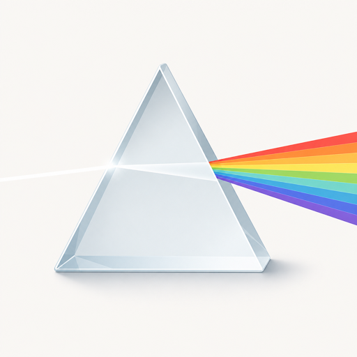
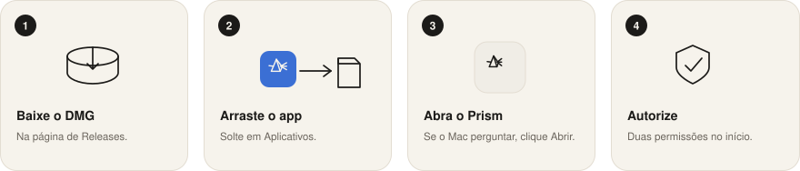
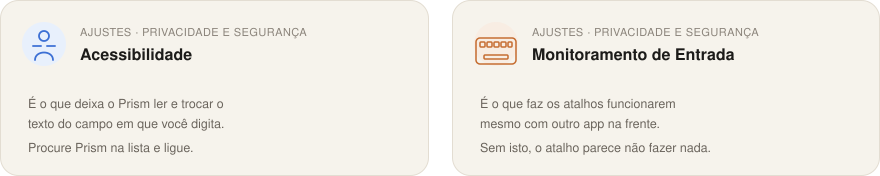
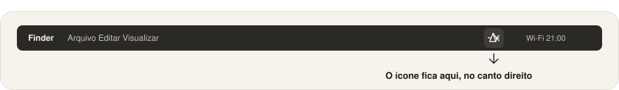

  

<h1 align="center">Prism Translate</h1>

  Traduz o texto do campo em que você está digitando. 
  Fica na barra de menus do Mac — rápido, quase sem janela.

  Edição Community · uso pessoal e estudo. Uso comercial precisa de licença à parte.

  

## Instalar

  

1. Baixe o `Prism-x.y.z.dmg` mais recente em [GitHub Releases](../../releases)
2. Abra o arquivo e arraste **Prism** para **Aplicativos**
3. Abra o app. O macOS avisa que veio da internet — clique em **Abrir**. Se bloquear, vá em **Ajustes do Sistema → Privacidade e Segurança** e clique em **Abrir Mesmo Assim**
4. Na primeira vez o Prism pede duas permissões. Sem elas ele não lê nem troca o texto.

  

**Acessibilidade** deixa o app pegar e colocar o texto. **Monitoramento de Entrada** deixa os atalhos funcionarem em qualquer programa. Os dois ficam em **Ajustes do Sistema → Privacidade e Segurança**. Procure **Prism** em cada lista e ligue.

Quando terminar de autorizar, o prisma aparece no canto direito do topo da tela:

  

## Usar

Sem configurar nada, a tradução é a da Apple, no próprio Mac.

  

Esses atalhos quase não brigam com os de outros apps. Dá para mudar — ou voltar ao padrão — em **Preferências → Atalhos**.

No menu do prisma:

- Escolha o idioma de destino
- Ligue ou desligue o app em **Ligado**
- Se quiser, ative **Enter traduz e envia** (aí o Enter sozinho também traduz)
- **Aviso perto do ponteiro** mostra um recado discreto na hora da tradução
- **Modo popup** abre um painel com a tradução, em vez de só substituir no campo

Em Preferências, **Abrir no login** deixa o Prism pronto quando você entra na conta.

## Outras formas de traduzir

O padrão é a tradução da Apple. Se quiser outra, abra **Preferências**:

- **DeepL** ou **Google** — você cola a chave da API
- **LM Studio** (ou qualquer servidor no estilo OpenAI) — no seu computador
- **HTTP personalizado** — se você já tem um endpoint próprio

As chaves ficam no chaveiro do Mac, não no código.

## Licença

Uso pessoal, estudo e pesquisa: ok. Empresa, produto ou qualquer uso comercial: precisa de uma licença combinada com o autor.

O texto completo está em [`LICENSE`](LICENSE) (PolyForm Noncommercial 1.0.0).

---

Quer abrir o projeto no Xcode, estudar ou modificar o código? Isso é **opcional** — só para quem clona o repositório. Veja o [guia de compilação](BUILDING.md).
